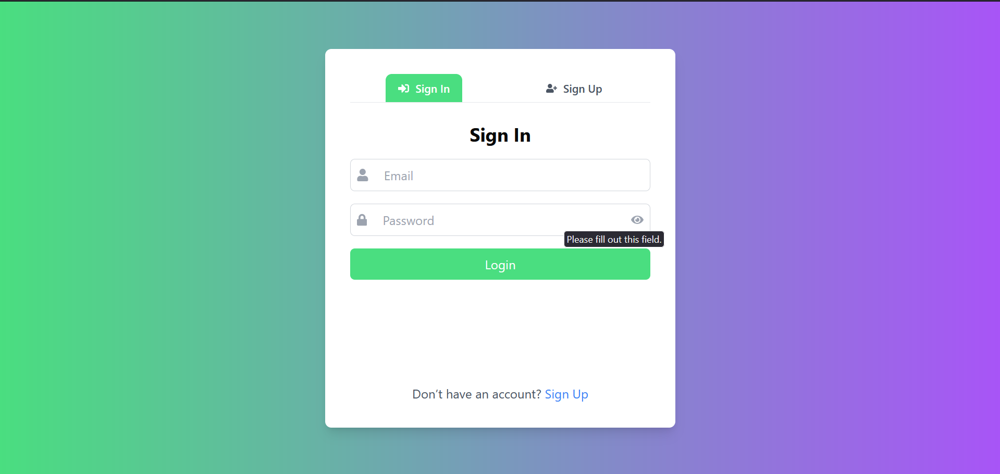
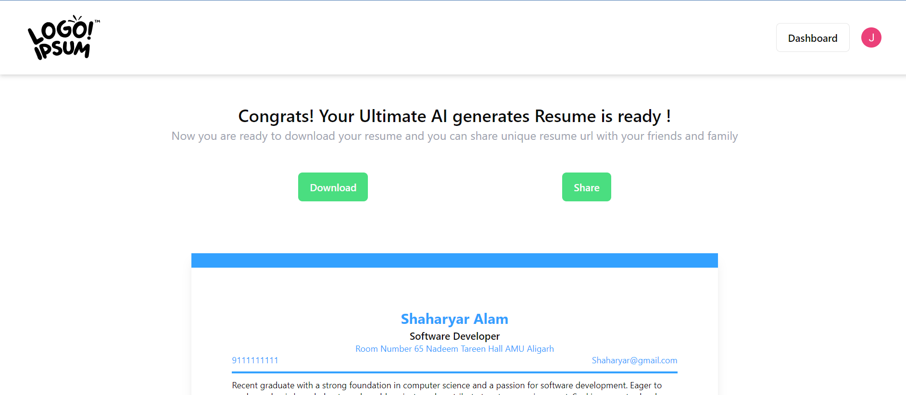

# AI Resume Builder

AI Resume Builder is a sophisticated web application that leverages artificial intelligence to help users craft professional resumes. The application features an intuitive interface and robust backend services for secure data management.

## Tech Stack

- **Frontend:** React.js, TailwindCSS, Redux Toolkit  
- **Backend:** Node.js, Express.js, Docker  
- **Database:** MongoDB  

## Features

### 1. 🔒 Secure User Authentication  
- Custom authentication with **bcrypt** password hashing  
- **JWT-based** session management  

  
  

### 2. 🏠 User Dashboard  
- View and manage previous resume versions  

  

### 3. 🎨 Customizable Templates  
- Choose from multiple resume templates  

  

### 4. 🤖 AI-Powered Suggestions  
- Smart resume content suggestions  

  

### 5. 🔍 Live Preview  
- See real-time resume updates  

  

### 6. 📄 Export Options  
- Download resumes in **PDF format**  

  

---
